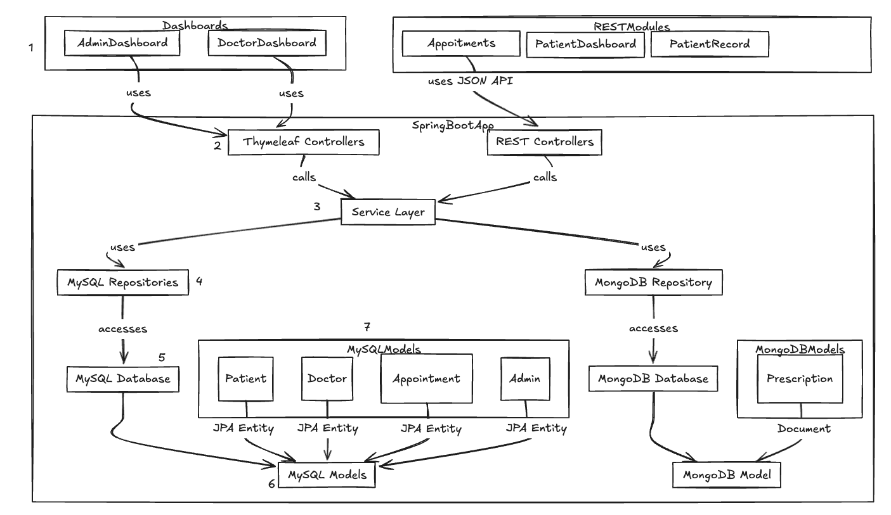

## Section 1: Architecture summary

This Spring Boot application adopts a hybrid architecture that incorporates both MVC and RESTful components to serve different user roles and functionalities. The Admin and Doctor interfaces are built using Thymeleaf templates rendered by MVC controllers, offering a dynamic, server-side HTML experience. In contrast, modules intended for patients—such as appointments, dashboard, and medical records—are exposed via REST APIs that return JSON, enabling seamless integration with front-end applications or third-party systems.

At the core of the system lies a unified service layer, which acts as the intermediary between the controllers and data repositories. This service layer encapsulates the application's business logic and ensures consistent interaction patterns across both MVC and REST components. The application is backed by two types of databases: a MySQL database that stores structured, relational data related to patients, doctors, appointments, and admin users; and a MongoDB database that manages unstructured, document-based data such as medical prescriptions. MySQL entities are mapped using JPA, while MongoDB documents are handled using dedicated domain models. This architectural separation allows for flexible, scalable handling of both transactional and document-centric data.

## Section 2: Numbered flow of data and control

1. **User Interface Interaction**  
   - Admin and Doctor users access the system through the `AdminDashboard` and `DoctorDashboard`, which use Thymeleaf templates.  
   - Patients interact with the system through `Appointments`, `PatientDashboard`, and `PatientRecord` modules via RESTful JSON APIs.

2. **Controller Invocation**  
   - The dashboards trigger `Thymeleaf Controllers`, while the REST modules invoke `REST Controllers`.  
   - Both types of controllers are part of the Spring Boot application and handle incoming user requests.

3. **Service Layer Delegation**  
   - Both `Thymeleaf Controllers` and `REST Controllers` delegate business logic execution to the central `Service Layer`, ensuring a consistent logic flow regardless of interface type.

4. **Repository Usage**  
   - The `Service Layer` interacts with two types of repositories depending on the data source: `MySQL Repositories` for relational data and `MongoDB Repository` for document-based data.

5. **Database Access**  
   - The repositories fetch and persist data to their respective databases:  
     - `MySQL Repositories` access the `MySQL Database`.  
     - `MongoDB Repository` accesses the `MongoDB Database`.

6. **Model Mapping**  
   - Data stored in databases is mapped using models:  
     - `MySQL Database` maps to `MySQL Models` defined as JPA entities.  
     - `MongoDB Database` maps to `MongoDB Models` defined as document schemas.

7. **Model Structure**  
   - The `MySQL Models` include `Patient`, `Doctor`, `Appointment`, and `Admin` entities.  
   - The `MongoDB Models` include `Prescription` as a document-based model.
